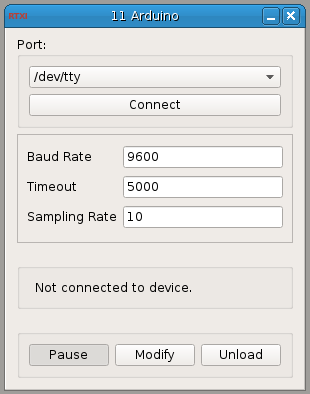

### Arduino

**Requirements:** Arduino  
**Limitations:** Non-RT  

<!--start-->
Acquire data in RTXI from an Arduino. (Non-RT)
<!--end-->

#### Input Channels
None  

#### Output Channels
1. Data - Int

#### Parameters
1. Baud Rate (bps)
2. Timeout - (Int) connection timeout  
3. Sampling Rate (Hz)

#### States
None  
